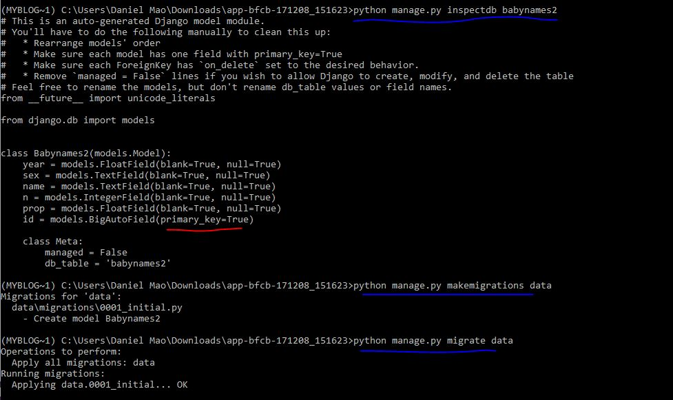

## Import csv file
```
DROP TABLE public."Training";

CREATE TABLE public."Training"
(
    "PassengerId" integer NOT NULL,
    "Survived" char(1) NOT NULL,
    "Pclass" char(1),
    "Name" char(250),
    "Sex" char(10),
    "Age" numeric(5,2),
    "SibSp" integer,
    "Parch" integer,
    "Ticket" char(50),
    "Fare" numeric(10, 4),
    "Cabin" char(50),
    "Embarked" char(1),
    CONSTRAINT "Training_pkey" PRIMARY KEY ("PassengerId")
)
WITH (
    OIDS = FALSE
)
TABLESPACE pg_default;

ALTER TABLE public."Training"
    OWNER to postgres;

COPY public."Training" FROM 'C:\Users\Daniemao\Documents\d3\Titanic\train.csv' DELIMITER ',' CSV HEADER;
```

## Access from django
Change the database setting using the database name and table name. Below is an example.
```python
DATABASES = {
    'default': {
        'ENGINE': 'django.db.backends.postgresql_psycopg2',
        'NAME': 'Titanic',
        'USER': 'postgres',
        'PASSWORD': '3326999',
        'HOST': 'localhost',
        'PORT': '5432',
    }
}
```
Run below create the model defination
```
python manage.py inspectdb Training
```
Because the table **already exists** in postgresql database. Run below code
```
python manage.py migrate --fake-initial
```
## Change column data type and create primary key
From django perspective, each table must have a key.
```
ALTER TABLE babynames2 ALTER COLUMN year TYPE integer; 

ALTER TABLE babynames2 ADD COLUMN id BIGSERIAL PRIMARY KEY;
```
